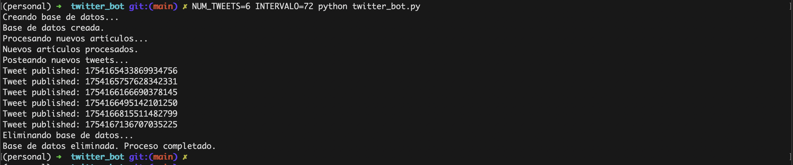

# Bot de Tweets de Noticias

## Resumen del Proyecto

Este repositorio contiene el código para un Bot de Tweets de Noticias, diseñado para scrapear automáticamente, resumir y tuitear artículos de noticias argentinas de diversas fuentes. Utiliza bibliotecas de Python como Tweepy, BeautifulSoup, Requests y la IA Generativa de Google (API de Gemini) para realizar tareas como raspado web, gestión de bases de datos, síntesis de texto y tuiteo.

## Características

- Scraping de Noticias: El bot puede extraer artículos de periódicos online como 'La Política Online', 'Ámbito Financiero' y 'Página 12'.
- Gestión de Bases de Datos: Utiliza SQLite para almacenar y gestionar los artículos extraídos.
- Síntesis de Texto: Emplea la API de GenerativeAI de Google para resumir los artículos de noticias.
- Publicación Automatizada en Twitter: Publica tweets con resúmenes y enlaces a los artículos originales.
Operación Continua: Configurado para publicar tweets de manera automática en intervalos regulares.

## Instalación

1. Instalación de Dependencias:

```bash
pip install -p requirements.txt
```
Las dependencias incluyen requests, bs4, tweepy y google-generativeai.

2. Configuración de Credenciales:
- Completar el archivo ```utils.credentials.py``` con las claves API necesarias:
    - Credenciales de Twitter (```API_KEY```, ```API_SECRET```, ```ACCESS_TOKEN```, ```ACCESS_TOKEN_SECRET```, ```BEARER_TOKEN```).
    - Clave de la API de GenerativeAI de Google (```GOOGLE_API_KEY```).


## Ejecución del Script
Para ejecutar el script, utiliza el siguiente comando, donde ```NUM_TWEETS``` es la cantidad de tweets que deseas publicar e ```INTERVALO``` es el tiempo entre la publicación de cada tweet. Por ejemplo, para publicar 10 tweets, el comando sería:

```bash
NUM_TWEETS=10 INTERVALO=15 python twitter_bot.py
```
Si no se especifica ```NUM_TWEETS```, el script utilizará un valor predeterminado de 5 tweets.
Si no se especifica ```INTERVALO```, el script utilizará un valor predeterminado de 10 segundos.



## Automatización con Cron

Puedes automatizar la ejecución del script twitter_bot.py utilizando cron, un programador de tareas en sistemas Unix. Esto te permitirá ejecutar el script a intervalos regulares (por ejemplo, cada hora o una vez al día) sin intervención manual.

### Configuración de Cron
Abrir Crontab: Abre el editor de crontab para tu usuario ejecutando el siguiente comando en la terminal:
```bash
crontab -e
```
Esto abrirá el archivo crontab en tu editor de texto predeterminado.
Agregar una Nueva Tarea Cron: Agrega una línea al final del archivo crontab siguiendo la sintaxis de cron. Por ejemplo, para ejecutar el script cada hora, puedes agregar:
```cron
0 * * * * /usr/bin/python /ruta/a/tu/script/twitter_bot.py
```
Asegúrate de reemplazar /usr/bin/python con la ruta completa a tu intérprete de Python y /ruta/a/tu/script/twitter_bot.py con la ruta completa al script twitter_bot.py.
Establecer la Variable de Entorno: Si deseas especificar un número de tweets diferente al valor predeterminado, puedes agregar la variable NUM_TWEETS directamente en la entrada de cron:
```cron
0 * * * * NUM_TWEETS=10 /usr/bin/python /ruta/a/tu/script/twitter_bot.py
```
Esto ejecutará el script cada hora y publicará 10 tweets en cada ejecución.
Guardar y Salir: Guarda los cambios y cierra el editor. cron se actualizará automáticamente con la nueva tarea.

### Verificación
Verificar Tareas de Cron: Para verificar que tu tarea se ha añadido correctamente, ejecuta:
```bash
crontab -l
```
Esto listará todas las tareas de cron programadas para tu usuario.
- Logs de Cron: Puedes revisar los logs de cron para verificar que la tarea se está ejecutando según lo previsto. La ubicación y el acceso a los logs de cron pueden variar según tu sistema.
Consideraciones
- Ruta de Trabajo: cron ejecuta el script en tu directorio personal por defecto, a menos que especifiques otra ruta. Si tu script depende de ejecutarse en un directorio específico, considera agregar un comando cd a tu tarea cron.
- Permisos: Asegúrate de que el script tenga los permisos necesarios para ejecutarse.
- Entorno de Ejecución: cron puede tener un entorno diferente al de tu sesión de usuario habitual. Si el script depende de variables de entorno o configuraciones específicas de tu usuario, asegúrate de que estén disponibles o definidas en el contexto de cron.

## Contribuciones

Se bienvenidas las contribuciones, problemas y solicitudes de características. No dudes en consultar la página de problemas para problemas abiertos o abrir un nuevo problema para discutir cambios o características que te gustaría agregar.
